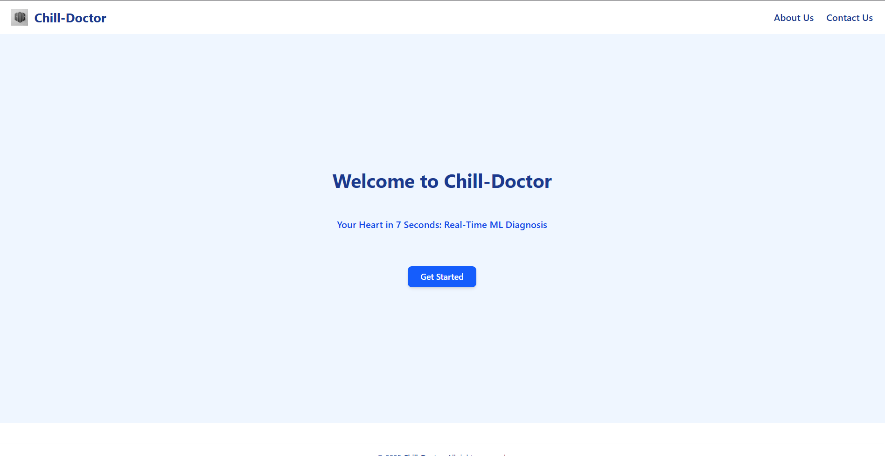
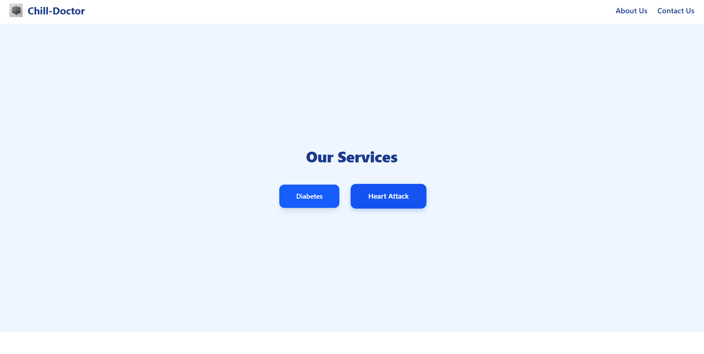
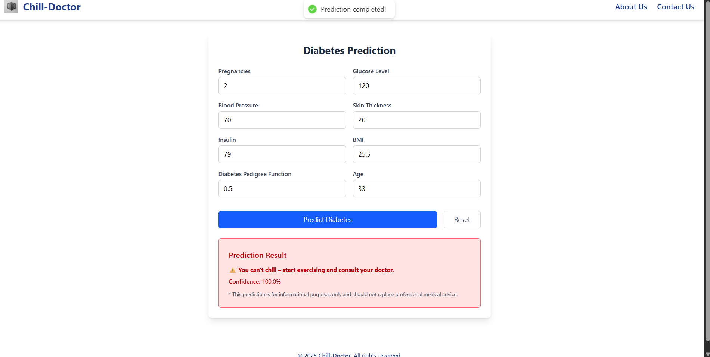
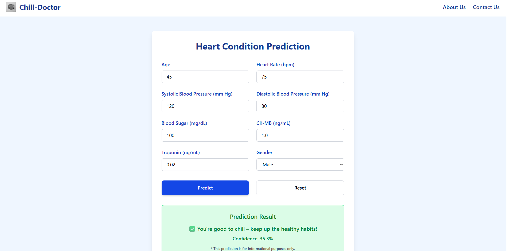
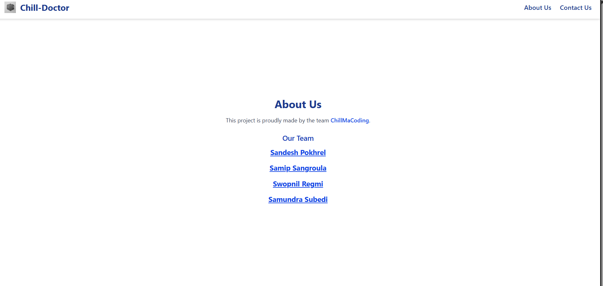
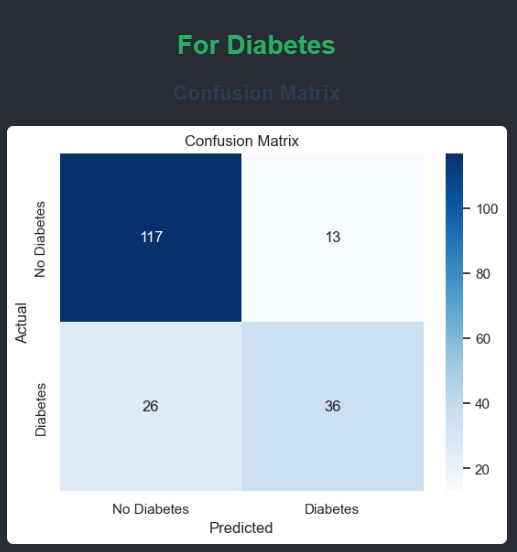
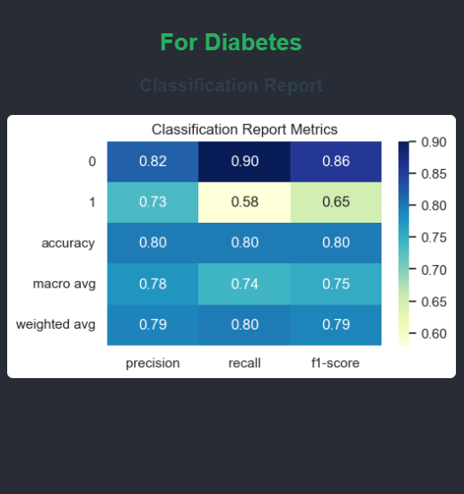
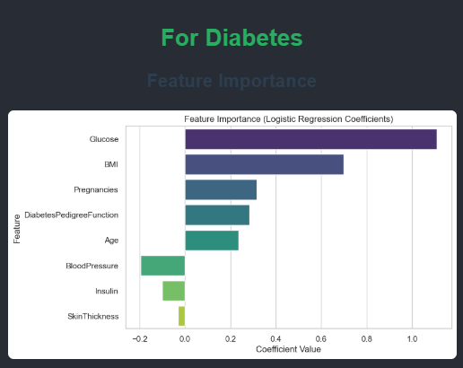
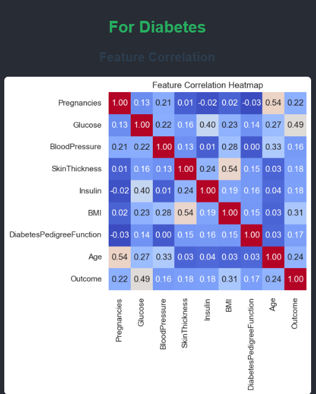

# 💓 Health Condition Prediction Web App

Welcome to the **Health Condition Prediction** project, developed by the team **ChillMaCoding**.

This application uses **Machine Learning** models to predict:
- 🧪 **Diabetes** based on 8 clinical features
- ❤️ **Heart Attack** likelihood using clinical test results

Users input their health information into a friendly frontend form. The backend sends this data to a trained ML model via an API to return a prediction along with the confidence percentage. It's fast, accurate, and built to provide a useful health insight.

---

## 🧠 Technologies Used

### Frontend
- ReactJS with Tailwind CSS
- Axios for API communication

### Backend
- Python
- Scikit-learn for Machine Learning
- Pandas, NumPy for data handling
- Matplotlib & Seaborn for visualizations

---

## ⚙️ Machine Learning Models Used

### ✅ Diabetes Prediction
- Algorithm: `Logistic Regression`
- Dataset: [PIMA Diabetes Dataset](https://www.kaggle.com/datasets/mathchi/diabetes-data-set)
- Features:
  - Pregnancies, Glucose, BloodPressure, SkinThickness, Insulin, BMI, DiabetesPedigreeFunction, Age

### ❤️ Heart Attack Prediction
- Algorithm: `Logistic Regression`
- Dataset: Custom dataset with 9 columns including:
  - Age, Gender, Heart rate, Blood pressure (systolic/diastolic), Blood sugar, CK-MB, Troponin

---

## 🖼️ UI Screenshots

Here are some screenshots of our application interface.

### 🔷 First

### ✅ Choose

### 🧪 Diabetes Input Form

### ❤️ Heart Attack Form

### ❤️ Team

---

## 📊 Model Performance Visuals

### 📉 Diabetes Model Metrics

#### Confusion Matrix

#### Classification Report

#### Diabetes Feature Importance

#### Feature Correlation

---

## 🙌 Meet the Team - ChillMaCoding

- [**Sandesh Pokhrel**](https://pokhrelsandesh.com.np)
- [**Samip Sangoula**](https://www.facebook.com/samip.sangroula)
- [**Swopnil Regmi**](https://www.facebook.com/swopnil.regmi.9)
- [**Samundra Subedi**](https://www.facebook.com/sammuundra.subedi)

---

## 🔗 Contact

For inquiries or collaboration, please visit  
🌐 [**https://pokhrelsandesh.com.np**](https://pokhrelsandesh.com.np)

---

> 🚨 **Note:** This tool is for educational and informational purposes only. It does not replace professional medical advice.

